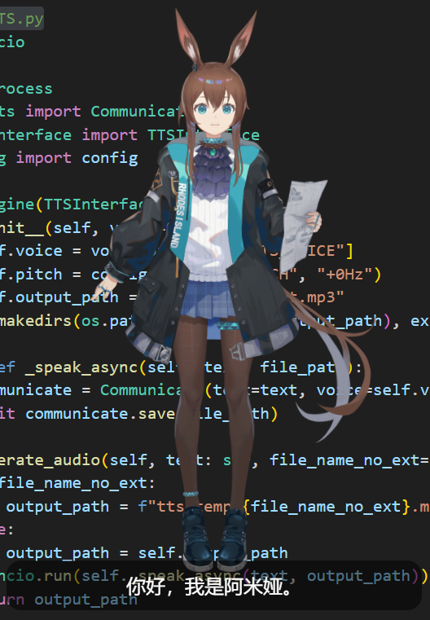

# 🐾 AUAK Live2D Desktop AI Vtuber
此项目是基于以前的老项目(未公开)，大约有一半以上进行了重构

一个基于 **PyQt6 + Live2D + Ollama + 多种 TTS + js + python +pyttsx3 + pydub + qwebchannel + deepseek等api代理选项（扩展中）** 的桌面 AI 助手项目，支持透明悬浮窗口、Live2D 虚拟角色、本地大语言模型聊天、语音合成（TTS），并实现了角色嘴型联动、眼睛/头部追踪鼠标等自然交互效果。



---

## ✨ 功能亮点

- 🖼️ **透明可移动的桌宠窗口**，支持鼠标拖拽
- 🧠 **本地大模型聊天系统**（支持 Ollama + Qwen2.5 或其他模型）
- 💬 **对话框 UI** 与 AI 实时响应同步
- 🔈 **Edge TTS / VoiceVox** 本地语音合成（支持嘴部动作同步）之后扩展更多 TTS 
- 👁️ **眼睛与头部追踪鼠标移动**
- 📦 模块化设计，方便拓展更多 TTS / LLM / 动作系统
- 🎨 **之后将会添加api代理商运行**
---

请先确保你已安装 Python 3.10+ 和 `pip`，并确保本地已安装以下工具：

- ✅ **Ollama**（https://ollama.com）支持下载LLM到本地
- ✅ **mpv**（用于播放语音）
- ✅ **Edge TTS**（https://www.edge-tts.com）或 **VoiceVox**（https://voicevox.ai）#当前加入的语音合成工具，可根据之后的扩展下载其它的 TTS
- PS. 此项目直接使用的python edge-tts包，之后项目会加入支持本地Edge TTS的功能（前提你电脑显存够用）

```bash
pip install -r requirements.txt
```
python main.py
首次启动会加载 prompt/Amiya.txt 作为角色设定。


## ⚙️ 配置文件

配置文件位于 `config.yaml`：

USE_OLLAMA: true
OLLAMA_MODEL: "qwen2.5:latest"

MOUTH_AMPLIFY: 3

TTS_MODEL: edgeTTS     # 可选：edgeTTS / voicevoxTTS / pyttsx3TTS ...（还在扩展中）

edgeTTS_MODEL: zh-CN-XiaoyiNeural
edgeTTS_VOICE: "+15Hz"

VOICEVOX:
  speaker: 1
  speed: 1.0
  pitch: 0.0

## 📦 模型和资源说明
Live2D 模型路径：live2d/live2d_web/model/Amiya/

初始设定文件：prompt/Amiya.txt（可自行建立数据集）

支持多种模型如 llama3, qwen2.5, gemma, mistral，可在 Ollama 中自定义。

ollama 模型下载地址：https://ollama.com/download/

voicevox 模型下载地址：https://voicevox.hiroshiba.jp/

Amiya免费模型原视频地址：https://www.bilibili.com/video/BV1bCQWYpESX/?spm_id_from=333.337.search-card.all.click&vd_source=03b8bea42a644cbe2e9c36aaeb3f8806

📸 效果预览：
【自写live2D桌面AI演示demo-哔哩哔哩】
https://www.bilibili.com/video/BV1nC5az5ERF/?spm_id_from=333.1387.homepage.video_card.click&vd_source=03b8bea42a644cbe2e9c36aaeb3f8806

@一条咸鱼 @pekka 我知道你在看着我捏


