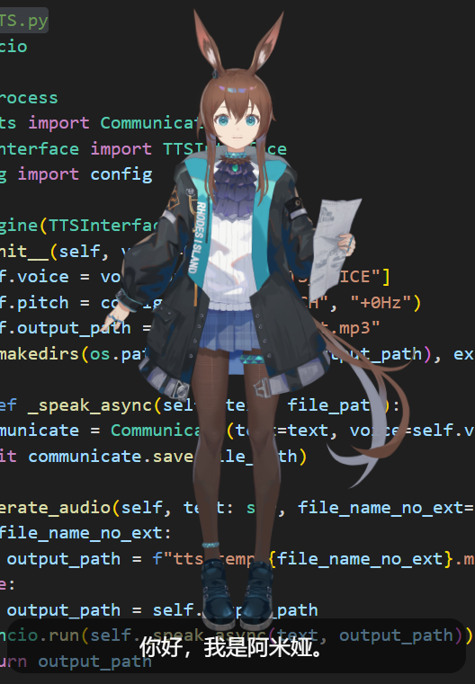

# 🐾 AUAK Live2D Desktop AI Assistant

一个基于 **PyQt6 + Live2D + Ollama + 多种 TTS + js + python +pyttsx3 + pydub + qwebchannel + deepseek等api代理选项（扩展中）** 的桌面 AI 助手项目，支持透明悬浮窗口、Live2D 虚拟角色、本地大语言模型聊天、语音合成（TTS），并实现了角色嘴型联动、眼睛/头部追踪鼠标等自然交互效果。



---

## ✨ 功能亮点

- 🖼️ **透明可移动的桌宠窗口**，支持鼠标拖拽
- 🧠 **本地大模型聊天系统**（支持 Ollama + 其他模型）
- 💬 **对话框 UI** 与 AI 实时响应同步
- 🔈 **Edge TTS / VoiceVox** 本地语音合成（支持嘴部动作同步）之后扩展更多 TTS 
- 👁️ **眼睛与头部追踪鼠标移动**
- 📦 模块化设计，方便拓展更多 TTS / LLM / 动作系统
- 🎨 **之后将会添加api代理商运行** 现已添加自定义Ai-api功能
---

请先确保你已安装 Python 3.10+ 和 `pip`，并确保本地已安装以下工具：

- ✅ **Ollama**（https://ollama.com）支持运行大模型
- ✅ **mpv**（用于播放语音）
- ✅ **Edge TTS**（https://www.edge-tts.com）或 **VoiceVox**（https://voicevox.ai）#当前加入的语音合成工具，可根据之后的扩展下载其它的 TTS 

```bash
pip install -r requirements.txt
```
python main.py
首次启动会加载 prompt/Amiya.txt 作为角色设定。


## ⚙️ 配置文件

配置文件位于 `config.yaml`：
USE_OLLAMA: false
OLLAMA_MODEL: "qwen2.5:latest"
MOUTH_AMPLIFY: 3

USE_CUSTOM_API: true
CUSTOM_API_URL: "https://api.siliconflow.cn/v1/chat/completions" #"http://your-custom-api-endpoint.com/v1/chat/completions"
CUSTOM_API_KEY: "" 
CUSTOM_API_MODEL: "Pro/deepseek-ai/DeepSeek-V3" 

CHARA_MODEL: "live2d"  #或"mmd","live2d"，"vrm"
TTS_MODEL: edgeTTS  #or voicevoxTTS gptsovitsTTS edgeTTS

# Live2D模型配置
# 填写模型文件夹名称，系统会自动拼接路径为: live2d_web/model/{live2d_model}/{live2d_model}.model3.json
# 例如：填写"森亚露露卡"，则路径为 live2d_web/model/森亚露露卡/森亚露露卡.model3.json
# 现在可以在运行时该字段可以动态修改并加载
live2d_model: "Amiya"


edgeTTS:
  voice: zh-CN-XiaoyiNeural 
  pitch: "+30Hz"

voicevoxTTS:
  speaker: 1
  speed: 1.0
  pitch: 0.0

gptsovitsTTS:
  api_base_url: "http://localhost:9880/tts" #GPT-SoVITS API 的地址，即在gptsovits中开启api_v2
  ref_audio_path: "D:/AUAK_Live2D_Desktop_AI/assets/Amiya.wav" 
  text_lang: "zh" #"zh", "ja", "en", "ko"
  prompt_lang: "zh" #"zh", "ja", "en", "ko"
  prompt_text: "博士整理一下航程信息吧"
  speed_factor: 1.0 

GPT_SOVITS_API_PATH: "D:/GPT-Sovits-Main" #where ur GPT-SoVITS-Main set 

ASR_MODEL: "Faster-Whisper"

Faster-Whisper:
  model_path: "large-v3"
  download_root: "asr/models"
  language: "zh"
  device: "cuda"

VRM_MODEL_PATH: "models/Amiya.vrm"
MMD_MODEL_PATH: "models/your_mmd_model.pmx"
MMD_ANIMATION_PATH: "models/your_mmd_animation.vmd"  


## 📦 模型和资源说明
Live2D 模型路径：live2d/live2d_web/model/Amiya/

初始设定文件：prompt/Amiya.txt（可替换为其他角色）

支持多种模型如 llama3, qwen2.5, gemma, mistral，可在 Ollama 中自定义。

ollama 模型下载地址：https://ollama.com/download/
voicevox 模型下载地址：https://voicevox.hiroshiba.jp/
Amiya免费模型原视频地址：https://www.bilibili.com/video/BV1bCQWYpESX/?spm_id_from=333.337.search-card.all.click&vd_source=03b8bea42a644cbe2e9c36aaeb3f8806

📸 效果预览


顺带一说，明日方舟真好玩🤪

@一条咸鱼 我知道你在看着我ο(=•ω＜=)ρ⌒☆


